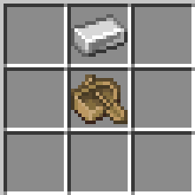

# Lancha

Craftable speed boats for Paper servers. Upgrade your boat by using better materials — iron, gold, or diamond — to get more horsepower and higher top speed.

## Features

- **Three tiers**: 50hp (iron), 100hp (gold), 150hp (diamond)
- **Smooth speed simulation**: acceleration, coast deceleration, and active braking by using the reverse control ("S" on PC).
- **Works with all boat types**: oak, spruce, birch, jungle, acacia, dark oak, mangrove, cherry, pale oak, and bamboo rafts
- **Configurable**: server operators can adjust a global speed multiplier
- **No client mod required**: works entirely server-side on Paper 1.21.4+

## Installation

1. Download the jar: [https://raw.githubusercontent.com/syntask/lancha/main/dist/lancha-1.0.0.jar](https://raw.githubusercontent.com/syntask/lancha/main/dist/lancha-1.0.0.jar)
2. Place `lancha-1.0.0.jar` in your server's `plugins/` folder
3. Restart the server (or run `/reload confirm`)

## Usage

### Crafting Recipes

Place the ingredient directly **above** a boat in the crafting table (or 2×2 grid):



| Ingredient | Result                 | HP  | Stats at 100% speed |
|------------|------------------------|-----|---------------------|
| Iron Ingot | Oak Speed Boat (50hp)  | 50  | max-boost: 0.7      |
| Gold Ingot | Oak Speed Boat (100hp) | 100 | max-boost: 1.4      |
| Diamond    | Oak Speed Boat (150hp) | 150 | max-boost: 2.1      |


The boat's wood type carries over to the result — a spruce boat makes a Spruce Speed Boat.

## Configuration

`plugins/Lancha/config.yml`

```yaml
# Global multiplier applied to all speed values.
# 1.0 = default, 2.0 = double speed, 0.5 = half speed.
global-speed-multiplier: 1.0
```

## Building from Source

Requires Java 17+ and Maven.

```bash
git clone https://github.com/syntask/lancha.git
cd lancha
mvn package
```

The compiled jar is written to `target/lancha-1.0.0.jar`.

## License

MIT
